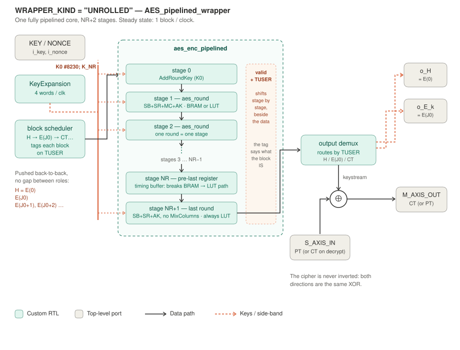
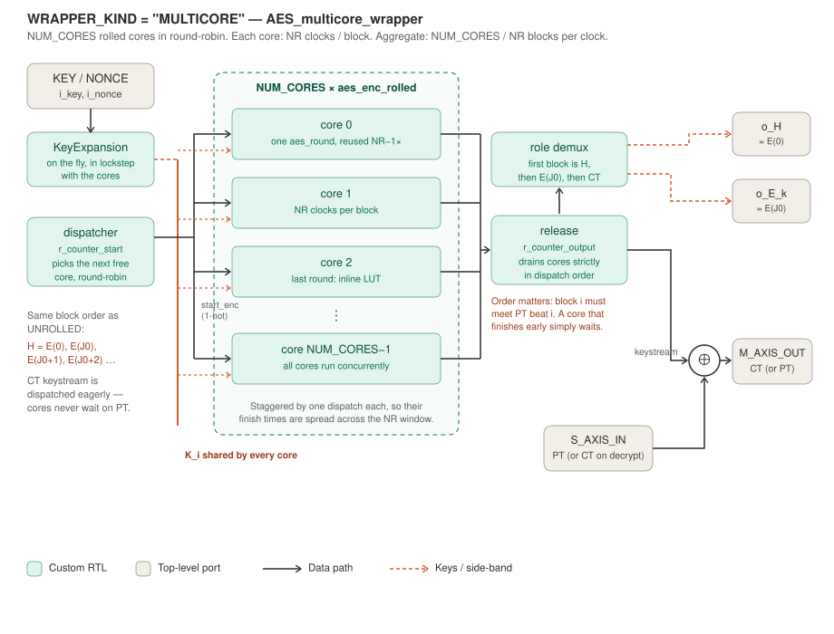
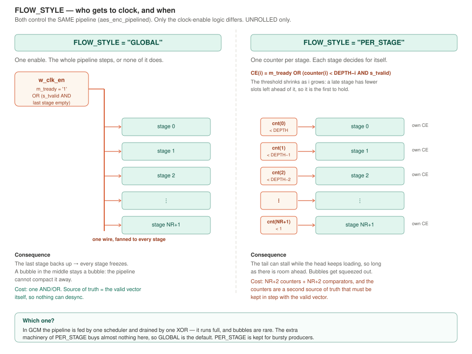
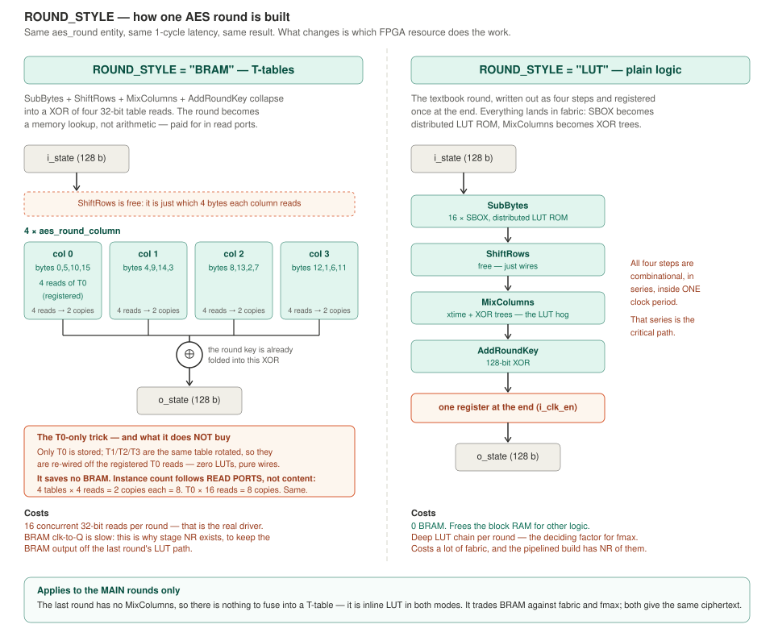
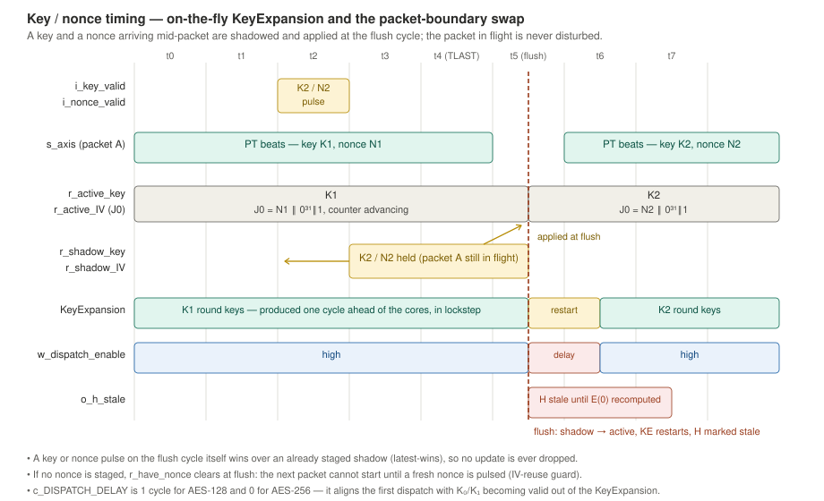

# AES_algorithm

The cipher behind the GCM glue. `AES_algorithm` itself is a thin selector: every
port passes straight through to one of two wrappers, picked by `WRAPPER_KIND`.

The port list carries no AES-specific signal, so a different algorithm can be
dropped in behind the same glue without touching the glue.

---

## Generics

| Generic | Values | Meaning |
|---|---|---|
| `AES_BITS` | `128` \| `256` | Key size; `i_key` is a 256-bit port and the low `AES_BITS` bits are used. AES-192 is rejected at elaboration. |
| `WRAPPER_KIND` | `"UNROLLED"` \| `"MULTICORE"` | **Which shape** the cipher has. See below. |
| `NUM_CORES` | integer | MULTICORE only: how many rolled cores run in round-robin. |
| `FLOW_STYLE` | `"GLOBAL"` \| `"PER_STAGE"` | UNROLLED only: how the pipeline's clock enables are derived. |
| `ROUND_STYLE` | `"BRAM"` \| `"LUT"` | Which FPGA resource computes a round. |

All four are resolved at synthesis. `WRAPPER_KIND` is the one that changes the
architecture; the other three are trade-offs *within* a choice.

---

## What the core actually computes

Per packet, in this order:

1. `H = E(0)` — the GHASH hash subkey, sent out on `o_H`
2. `E(J0)` — the tag mask, sent out on `o_E_k`
3. `E(J0+1), E(J0+2), …` — the keystream, XORed with the AXIS data

The block cipher is **never inverted**. GCM is counter mode, so decryption is
the same forward AES and the same XOR — which is why the encrypt and decrypt
glues instantiate the identical core.

---

## WRAPPER_KIND = "UNROLLED"



One `aes_enc_pipelined`, NR+2 stages deep (12 for AES-128, 16 for AES-256).
**Steady state: 1 block / clock.**

The interesting part is how H, E(J0) and the keystream share one pipeline. They
are not scheduled in separate phases — the block scheduler pushes them
back-to-back and tags each one on **TUSER**, a 2-bit side-channel that shifts
down the pipeline *beside* the data. At the far end, an output demux reads the
tag and routes the block to `o_H`, to `o_E_k`, or into the XOR. The pipeline
itself never inspects the tag; it just carries it.

Two stages exist for timing rather than for AES:

- **stage NR** — a plain register that breaks the path from the BRAM output of
  round NR−1 into the last round's LUT logic. Without it that path had four LUT
  levels after BRAM clk-to-Q and missed timing.
- **stage NR+1** — the last round: SubBytes + ShiftRows + AddRoundKey, no
  MixColumns. It is always inline LUT (see ROUND_STYLE below).

---

## WRAPPER_KIND = "MULTICORE"



`NUM_CORES` copies of `aes_enc_rolled` — a single `aes_round` reused NR−1 times.
Each core takes **NR clocks per block**; a dispatcher hands blocks out round-robin,
so the aggregate is **NUM_CORES / NR blocks per clock**.

Three things are worth knowing:

**KeyExpansion runs on the fly.** It produces `K_i` exactly one cycle before the
cores read it, in lockstep. There is no global "keys ready" handshake — dispatch
starts immediately after `i_key_valid`.

**Dispatch is eager.** Cores start computing keystream as soon as they are free;
they do **not** wait for `s_axis_tvalid`. They have to: on the decrypt path
`s_axis_tready` itself depends on a keystream being ready, so waiting for data
would deadlock. Any keystream left unused at the end of a packet is discarded on
flush.

**Release is strictly in order.** Block *i* of the keystream must meet PT beat
*i*, so `r_counter_output` drains the cores in dispatch order. A core that
finishes early simply waits its turn.

The round-robin is two independent pointers, not one:

| Pointer | Advances on | Meaning |
|---|---|---|
| `r_counter_start` | every accepted `start_enc` | which core receives the next block |
| `r_counter_output` | every released result | which core's result is emitted next |

Splitting them is what lets dispatch run ahead of release: the start pointer can
be several cores in front while the output pointer waits for the AXIS handshake.
Both reset to core 0 on flush, so a packet always begins on a known core.

What a released block *is* — H, `E(J0)` or keystream — is not stored per core
either; it follows from the capture flags (`w_out_is_ct` is high once both H and
`E(J0)` have been captured). H and `E(J0)` are released unconditionally, since
nothing downstream has to accept them; a CT block is released only on a full
`s_axis_tvalid` / `m_axis_tready` handshake.

### Which one?

| | UNROLLED | MULTICORE |
|---|---|---|
| Throughput | 1 block / clk | NUM_CORES / NR blocks / clk |
| Area | NR round instances | NUM_CORES round instances |
| Scales by | (fixed) | `NUM_CORES` |

Note the ceiling: `GHASH_wrapper` ingests one block every **2 clocks**, so the
GCM stack tops out at 0.5 blocks/cycle regardless. Cores beyond what the
`AAD ‖ CT` path can feed buy latency hiding, not bandwidth.

---

## FLOW_STYLE — GLOBAL vs PER_STAGE



Both drive the **same** pipeline; only the clock-enable logic differs.

**GLOBAL** derives one enable and fans it to every stage. The whole pipeline
steps together or not at all. The valid vector is the single source of truth, so
nothing can desync — but a bubble in the middle stays a bubble, and if the last
stage backs up, everything freezes.

**PER_STAGE** gives each stage its own occupancy counter and a threshold that
falls with the stage index (`DEPTH − i`), so later stages stop accepting before
earlier ones do. Each counter increments when an item enters its stage without
one leaving the pipeline, decrements on the opposite, and holds otherwise. The
head can keep loading while the tail stalls, and bubbles get squeezed out. The
price is NR+2 counters and comparators — and a *second* source of truth that has
to stay in step with the valid vector, which is exactly the desync GLOBAL avoids
by having none.

In GCM the pipeline is fed by one scheduler and drained by one XOR, so it runs
full and bubbles are rare. **GLOBAL is the default**; PER_STAGE is kept for
bursty producers.

---

## ROUND_STYLE — BRAM vs LUT



Same `aes_round` entity, same 1-cycle latency, same ciphertext. What changes is
which FPGA resource does the work.

**BRAM** uses the T-table technique: SubBytes + ShiftRows + MixColumns +
AddRoundKey collapse into a XOR of four 32-bit table reads, so the round becomes
a memory lookup instead of arithmetic. ShiftRows is free — it is just *which*
four bytes each column reads.

The T-table is stored **once**. T1/T2/T3 are the same table rotated, so they are
derived by re-wiring the registered T0 reads: zero LUTs, pure wire order. Each
column is one `aes_round_column` instance issuing four reads into its own T0
copy; the per-bit XOR that combines the four rotated reads with the round key
has five inputs, so it fits in a single LUT6 per output bit.

ShiftRows is not a step here at all — it is *which* four state bytes each column
instance is wired to (column 0 reads bytes 0, 5, 10, 15; column 1 reads 4, 9, 14,
3; and so on). It costs nothing because it never happens.

Two implementation notes that are easy to lose and expensive to rediscover:

* the `rom_style` attribute must sit on a **local signal inside the
  architecture**, not on the package constant — Vivado silently ignores it on
  package constants (Synth 8-5733), and the table lands in LUTs instead of BRAM;
* the T0 output registers deliberately have **no reset**. A reset on a BRAM
  output register can block BRAM inference, and the registers are overwritten on
  every enabled clock anyway.

### The T0-only trick does not save BRAM

It is tempting to say "one table instead of four, so 3/4 less BRAM". That is
**wrong**, and worth being precise about, because BRAM instance count is set by
**concurrent read ports**, not by how many bytes you store. A ROM has a fixed
number of read ports (2 per instance); to serve N simultaneous reads you must
replicate it ⌈N/2⌉ times, whatever it contains.

One round issues **16 concurrent 32-bit reads** (4 columns × 4 bytes):

| | reads per table | copies per table | total copies |
|---|---|---|---|
| Classic T0/T1/T2/T3 | 16/4 = 4 | ⌈4/2⌉ = 2 | 4 × 2 = **8** |
| T0-only | 16 | ⌈16/2⌉ = 8 | 1 × 8 = **8** |

**Identical.** In the classic scheme each of the four tables already has to be
duplicated (4 reads > 2 ports), so the content you "saved" comes straight back
as port replication. There is no arrangement in which 16 parallel reads fit in
fewer ports.

What T0-only actually buys is a **single ROM initialiser instead of four**, with
the other three tables reduced to wire rotations. It is a source-level
simplification, not an area optimisation. The real cost driver — 16 concurrent
reads per round — is unchanged, and the true instance count belongs in the Vivado
utilisation report, not in a comment.

**LUT** writes the round out as four steps and registers it once at the end.
Everything lands in fabric: SBOX as distributed LUT ROM, MixColumns as XOR trees.
Zero BRAM, but the four combinational steps sit in series inside one clock period,
and that series is the critical path.

This applies to the **main** rounds only. The last round has no MixColumns, so
there is nothing to fuse into a T-table — it is inline LUT either way.

---

## Key and nonce timing



Both wrappers share one key/nonce discipline, and it is where most of the
wrapper's control logic actually lives.

### KeyExpansion runs on the fly

There is no "expand the key, then start" phase and no keys-ready handshake. The
`KeyExpansion` block produces `K_i` exactly one cycle before the round that
consumes it, in lockstep with the cores, so a new key costs no idle packet — the
first block starts as soon as the first round key is on the wire.

The one thing that has to be aligned is *when* the first dispatch may fire, and
that differs per key size:

| | K₀ / K₁ valid | `c_DISPATCH_DELAY` |
|---|---|---|
| AES-256 | both in cycle 2 out of `LOAD` | `0` |
| AES-128 | K₁ only in cycle 3 (one EXPAND cycle first) | `1` |

`w_dispatch_enable` holds `start_enc` low for that many cycles after
`r_ke_new_key`; from there the expander and the cores advance together.

### A key or nonce arriving mid-packet

Neither may disturb a packet already in flight: the round keys are being read
*this cycle*, and the counter block is mid-sequence. So the wrapper keeps a
shadow of each:

* **`r_active_key` / `r_active_IV`** — what the packet in flight is using.
* **`r_shadow_key` / `r_shadow_IV`** — what arrived while it was in flight.

At the flush cycle (the TLAST CT handshake) the shadow is promoted to active,
the expander restarts on the new key, and `o_h_stale` goes high until the new
`H = E(0)` has been recomputed — a downstream GHASH gate holds the next packet
until it is fresh. Three rules make the corner cases behave:

1. **Latest wins.** A pulse landing *on* the flush cycle overrides an
   already staged shadow, so an update is never silently dropped.
2. **Nonce-before-key and key-without-nonce are both legal.** They are staged
   independently; the packet simply waits until both are in place.
3. **IV-reuse guard.** If no nonce is staged, `r_have_nonce` clears at flush and
   the next packet cannot start until a fresh nonce is pulsed. Silently reusing
   the previous counter block is not reachable from the interface.

The key-race freeze reproducers in `tests/gcm_core_AES` sweep the key pulse
across every offset around the nonce pulse and the flush cycle, which is what
these three rules are there to survive.

---

## Verification

```bash
cd ../tb && ./run_ghdl.sh
```

`tb_AES_multicore_wrapper` covers the core. Standard compliance is pinned by the
NIST KAT in the full chain (`tests/l3_full_chain`), which is what proves the
keystream matches the spec rather than merely matching itself.
