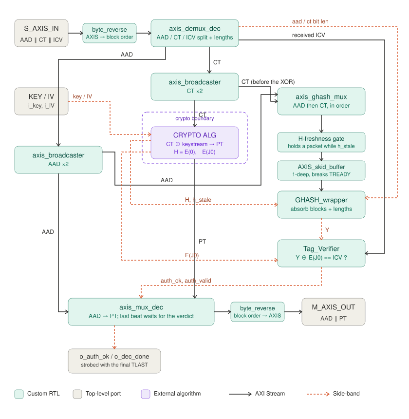

# gcm_dec_glue

The mirror of `gcm_enc_glue`. It takes `AAD ‖ CT ‖ ICV` and produces `AAD ‖ PT`,
plus the authentication verdict on `o_auth_ok`. The algorithm core sits **outside**
the entity, behind the same crypto boundary.



---

## Interface

| Generic | Meaning |
|---|---|
| `AAD_BEATS` | AAD length in beats: `ceil(AAD_BYTES / (DATA_WIDTH/8))`. |
| `AAD_BYTES` | AAD length **in bytes**; the GHASH lengths block uses `len(A) = AAD_BYTES · 8`, so the AAD need not be a multiple of the bus width. |
| `DATA_WIDTH` | Bus width in bits. 128 is the target. |
| `MULT_CYCLES` | GHASH multiply timing: `2` (default) registers the Karatsuba-32 layer, `1` computes the whole multiply in one combinational cone. |

| Port group | Direction | Meaning |
|---|---|---|
| `s_axis_*` | in | `AAD ‖ CT ‖ ICV`. **`TLAST` must land on the ICV beat, and the ICV must be alone on it.** |
| `m_axis_*` | out | `AAD ‖ PT`, `TLAST` on the last PT beat |
| `i_key`, `i_nonce` | in | 256-bit key (the core uses the low `AES_BITS` bits) and the 96-bit GCM nonce |
| `o_auth_ok`, `o_dec_done` | out | the verdict, strobed on the same handshake as the final `TLAST` |
| `o_DEC_in_proc` | out | busy flag |
| crypto boundary | both | identical to the encrypt side |

**Input contract.** `axis_demux_dec` requires the tag to arrive alone on the
`TLAST` beat. `SPLIT_demux` packs CT and ICV contiguously, so in the full chain
`ICV_realign` sits in front of this core and re-aligns them.

---

## The crypto boundary

| Direction | Ports | Meaning |
|---|---|---|
| glue → alg | `o_crypto_key`, `o_crypto_nonce` | key / nonce, straight pass-through; the algorithm forms `J0 = nonce ‖ 0^31 ‖ 1` |
| glue → alg | `m_ct_axis_*` | the ciphertext to transform |
| alg → glue | `s_pt_axis_*` | the recovered plaintext |
| alg → glue | `i_crypto_H` | `H = E(0)` |
| alg → glue | `i_crypto_E_k` | `E(J0)` |
| alg → glue | `i_crypto_h_stale`, `i_crypto_in_proc` | rekey / busy handshake |

The decrypt path uses the **same** core as the encrypt path, running **forwards**.
GCM is a counter-mode construction, so decryption is `CT ⊕ keystream` — the block
cipher is never inverted.

---

## What is inside

| Block | Role |
|---|---|
| `byte_reverse` (×2) | The byte-order bridge at the two AXIS ports. |
| `axis_demux_dec` | Splits `s_axis` into AAD, CT and the received ICV, and emits `len(A)` / `len(C)`. States: `S_AAD → S_CT_FIRST → S_CT_STREAM → S_EMIT_ICV`. |
| `axis_broadcaster` (×2) | Fan out AAD and CT, each `1 → 2`. |
| `axis_ghash_mux` | Concatenates `AAD` then `CT` for GHASH. |
| H-freshness gate + `AXIS_skid_buffer` | Same as on the encrypt side. |
| `GHASH_wrapper` | Absorbs the blocks and the lengths, produces `Y`. |
| `Tag_Verifier` | Compares the received ICV against `Y ⊕ E(J0)`. |
| `axis_mux_dec` | Re-assembles `AAD → PT`. States: `S_AAD → S_PT → S_EMIT`. |

---

## Three things worth knowing

### GHASH runs over the *received* CT — before the XOR

Per NIST GCM, the decryptor authenticates the ciphertext it received, not the
plaintext it recovered. That is why the CT broadcaster sits **between the demux
and the algorithm**, not after it: one copy goes to GHASH untouched, the other
goes out over the crypto boundary to be XORed.

### One beat of look-behind in the demux

The last CT beat is only knowable when the ICV arrives, so `axis_demux_dec` delays
the CT stream by one beat through a skid so `m_ct_tlast` can fire on the real last
CT. `S_CT_FIRST` exists purely to prime that skid. `len(C)` is latched on the
ICV-arrival cycle and `o_len_valid` pulses one cycle later, aligned with it.

### The last beat waits for the verdict

`axis_mux_dec` holds the final PT beat in `S_EMIT` until the auth result is
available, then emits it together with `TLAST`, `o_dec_done` and the latched
`o_auth_ok` — **all on the same handshake**. A consumer therefore learns whether
the packet is authentic at the exact moment it receives its last byte, and can
drop the packet on `o_auth_ok = '0'`.

`Tag_Verifier` accepts `Y` and the received ICV **in any order**; pending flags
hold whichever lands first.

---

## Byte order and throughput

Identical to the encrypt side: the byte/bit reversal lives at the two AXIS ports
only (verified against NIST SP 800-38D test case 4), and `GHASH_wrapper` caps
the stack at **0.5 blocks/cycle** with `MULT_CYCLES = 2`, or **1 block/cycle**
with `MULT_CYCLES = 1`.

---

## Verification

No standalone testbench; verified in the full chain:

```bash
cd ../../../tests/l3_full_chain && ./run_tests.sh
```

The **LOOPBACK** suite is the one that exercises this core end to end: the packet
must round-trip byte-identical **and** the tag must verify. The **KAT** suites
prove standard compliance on the encrypt side, which pins the shared GHASH and
lengths logic.
