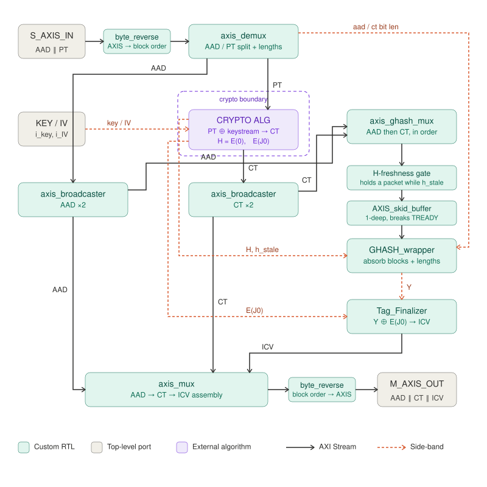

# gcm_enc_glue

Everything in GCM **except the cipher**. It takes `AAD ‖ PT` and produces
`AAD ‖ CT ‖ ICV`, driving an algorithm core that sits **outside** the entity,
behind the crypto boundary.



---

## Interface

| Generic | Meaning |
|---|---|
| `AAD_BEATS` | AAD length in beats: `ceil(AAD_BYTES / (DATA_WIDTH/8))`. `0` = no AAD path. |
| `AAD_BYTES` | AAD length **in bytes**. The GHASH lengths block uses `len(A) = AAD_BYTES · 8`, so the AAD does **not** have to be a multiple of the bus width. |
| `DATA_WIDTH` | Bus width in bits. 128 is the target. |
| `MULT_CYCLES` | GHASH multiply timing: `2` (default) registers the Karatsuba-32 layer, `1` computes the whole multiply in one combinational cone. |

| Port group | Direction | Meaning |
|---|---|---|
| `s_axis_*` | in | `AAD ‖ PT`, `TLAST` on the last PT beat |
| `m_axis_*` | out | `AAD ‖ CT ‖ ICV`, `TLAST` on the ICV beat |
| `i_key`, `i_nonce` | in | 256-bit key (the core uses the low `AES_BITS` bits) and the 96-bit GCM nonce |
| `o_ENC_in_proc`, `o_TxENC` | out | busy flag and a 32-bit counter of emitted packets (`i_tick` resets it) |
| crypto boundary | both | see below |

The PT length is **not** a generic — it is discovered at run time from `TLAST`.

---

## The crypto boundary

The glue contains no cipher. It exposes a fixed port list and drives whatever is
wired to it:

| Direction | Ports | Meaning |
|---|---|---|
| glue → alg | `o_crypto_key`, `o_crypto_nonce` | key / nonce, straight pass-through; the algorithm forms `J0 = nonce ‖ 0^31 ‖ 1` |
| glue → alg | `m_pt_axis_*` | the plaintext to transform |
| alg → glue | `s_ct_axis_*` | the ciphertext coming back |
| alg → glue | `i_crypto_H` | `H = E(0)` — the GHASH hash subkey |
| alg → glue | `i_crypto_E_k` | `E(J0)` — the tag mask |
| alg → glue | `i_crypto_h_stale`, `i_crypto_in_proc` | rekey / busy handshake |

`AES_algorithm` is the core wired today; any module with this port list drops in
unchanged. This is why the diagram says **CRYPTO ALG** rather than AES.

---

## What is inside

| Block | Role |
|---|---|
| `byte_reverse` (×2) | The byte-order bridge at the two AXIS ports — see below. |
| `axis_demux` | Splits `s_axis` into the AAD stream and the PT stream, and emits `len(A)` / `len(C)` for the GHASH lengths block. States: `S_AAD → S_PT`. |
| `axis_broadcaster` (×2) | Fan out AAD and CT, each `1 → 2`: one copy to GHASH, one copy to the output mux. |
| `axis_ghash_mux` | Concatenates `AAD` then `CT` into the single stream GHASH absorbs. |
| H-freshness gate | Holds a packet at the GHASH ingress while `h_stale` is high — see below. |
| `AXIS_skid_buffer` | 1-deep skid so no beat is lost when `GHASH_wrapper` drops `TREADY` (its `S_WAIT_LEN` / `S_SEND_LEN` / `S_WAIT_Y` states). |
| `GHASH_wrapper` | Absorbs the blocks, then the lengths block, and produces `Y`. |
| `Tag_Finalizer` | `ICV = Y ⊕ E(J0)`, emitted as one AXIS beat. |
| `axis_mux` | Re-assembles `AAD → CT → ICV`. States: `S_AAD → S_CT → S_ICV`; `TLAST` fires on the ICV beat. |

---

## Two things worth knowing

### The byte-order bridge (rev 0.03)

AXIS carries byte 0 of the stream in the **LSB** lane, while AES and GHASH place
byte 0 of a 128-bit block at the **MSB**. The bridge sits at exactly two points —
the AXIS slave port and the AXIS master port. `TDATA` is reversed by byte and
`TKEEP` by bit, so the "keep bit *i* marks byte *i*" invariant survives and
nothing inside the glue had to change. A partial beat then lands its valid bytes
at the top of the block, which *is* the GCM zero-padding rule.

This matters because **a wrong-but-consistent byte order round-trips perfectly**.
An encrypt→decrypt loopback cannot see it; only a known-answer test can. Verified
against NIST SP 800-38D test case 4.

### The H-freshness gate

`GHASH_wrapper` latches `H` on its valid pulse, but the absorb stream is **not**
data-dependent on `H` — AAD beats never touch the keystream. Under dense
streaming the first beats of a packet can therefore reach GHASH *before* `H` for
that packet's key has been computed.

The algorithm core reports this directly on `i_crypto_h_stale`. The gate holds the
GHASH ingress while it is high:

```vhdl
w_gh_gate_open <= r_gh_in_pkt or (not w_h_stale);
```

A packet that is **already absorbing** is never stalled — its `H` is final and it
must drain — which is what `r_gh_in_pkt` tracks.

---

## Throughput

`MULT_CYCLES` sets the GHASH ingest rate, and with it the ceiling of the whole
GCM stack:

| `MULT_CYCLES` | GHASH ingest | stack ceiling | GF(2^128) multiply |
|---|---|---|---|
| `2` (default) | one beat every 2 clocks | **0.5 blocks/cycle** | split in two stages by a partial-product register bank; shorter critical path |
| `1` | one beat per clock | **1 block/cycle** | one combinational cone; longest critical path, lower fmax |

Whatever the setting, GHASH — not the cipher — is what the stack tops out at:
crypto cores beyond what the `AAD ‖ CT` path can feed buy latency hiding, not
bandwidth.

---

## Verification

The glue has no standalone testbench; it is verified in the full chain:

```bash
cd ../../../tests/l3_full_chain && ./run_tests.sh
```

- **KAT** — NIST SP 800-38D test case 4 (AAD = 20 B, PT = 60 B, both partial).
- **KAT length sweep** — every AAD / PT residue mod 16 against a software AES-GCM
  reference. This is what proves the partial-block path is standard compliant
  rather than merely self-consistent.
- **ENC / LOOPBACK** — packet geometries × back-pressure profiles.
