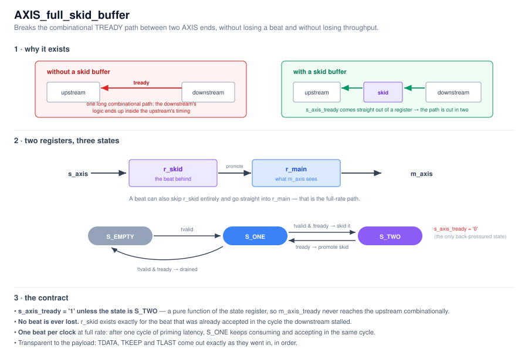

# AXIS_full_skid_buffer

A full AXI-Stream skid buffer (`TDATA` / `TKEEP` / `TLAST`). It is transparent to
the payload — whatever goes in comes out, in order, once — and exists purely for
timing.



---

## Interface

| Generic | Meaning |
|---|---|
| `DATA_WIDTH` | Bus width in bits. Verified for 32 / 64 / 128 / 256. |

Ports are standard AXIS (`tdata/tkeep/tvalid/tlast/tready`), one clock `i_clk`,
active-low reset `i_rstn`.

---

## Why

`m_axis_tready` is an input that, in a naive pass-through, feeds
`s_axis_tready` combinationally. That stitches the downstream's timing directly
into the upstream's, and the ready path becomes one of the longest in the design.

This core cuts it: **`s_axis_tready` is a pure function of the state register**.
Nothing on the master side can reach it within the same cycle.

The catch is that if `s_axis_tready` is registered, it is by definition *stale* —
it may still be high in the cycle the downstream stalls, so a beat gets accepted
that there is no room for. `r_skid` is the room for exactly that beat. Hence
"skid": the buffer absorbs the one beat that was already in flight when the brakes
went on.

---

## States

Two registers: `r_main` (what the master port drives) and `r_skid` (the beat
behind it).

| State | Meaning | `s_axis_tready` | `m_axis_tvalid` |
|---|---|---|---|
| `S_EMPTY` | nothing held | `1` | `0` |
| `S_ONE` | `r_main` holds the beat the downstream sees | `1` | `1` |
| `S_TWO` | `r_main` is stalled and `r_skid` holds the beat behind it | **`0`** | `1` |

Transitions:

| From | Condition | To | What moves |
|---|---|---|---|
| `S_EMPTY` | `s_tvalid` | `S_ONE` | input → `r_main` |
| `S_ONE` | `s_tvalid` and `m_tready` | `S_ONE` | input → `r_main` (consume + accept, same cycle — **this is the full-rate path**) |
| `S_ONE` | `s_tvalid` and not `m_tready` | `S_TWO` | input → `r_skid` |
| `S_ONE` | not `s_tvalid` and `m_tready` | `S_EMPTY` | drained |
| `S_TWO` | `m_tready` | `S_ONE` | `r_skid` → `r_main` |

`S_TWO` is the only back-pressured state, and it is exactly the "both registers
full" case.

---

## Cost and throughput

- **Latency:** one cycle. A beat presented in cycle *n* appears on `m_axis` in
  cycle *n+1*.
- **Throughput:** one beat per clock, sustained. In `S_ONE` the buffer consumes
  and accepts in the same cycle, so after the single priming cycle there are no
  bubbles at full rate.
- **Area:** two beats of registers (`2 × (DATA_WIDTH + DATA_WIDTH/8 + 1)` bits)
  plus a 3-state FSM.

Only the state register is reset; the data registers are plain clock-enabled
flip-flops, which keeps them in a form the tools map efficiently.

---

## Testbench

`tb/tb_AXIS_full_skid_buffer.vhd` (self-checking) + `tb/run_skid_buffer_tests.sh`
(GHDL, `--std=08 -fsynopsys`).

The TB drives `BEATS` beats, each with its own data / keep / last pattern (every
8th beat partial, every 16th ending a packet), and checks every output beat
against the same reference — so a **dropped, duplicated or re-ordered** beat is
caught. `TVALID` and `TREADY` are randomly gated at `P_VALID` / `P_READY` percent.

It also checks the two properties the core exists for:

- **full rate** — with both `TVALID` and `TREADY` held high, no bubble ever appears
  after the priming cycle;
- **no ready path** — `s_axis_tready` is high straight out of reset, before any
  handshake activity could have driven it.

```bash
cd tb && ./run_skid_buffer_tests.sh
```
