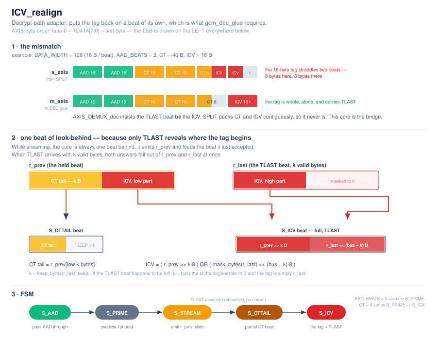

# ICV_realign

Decrypt-path adapter. It sits between `SPLIT_demux` and `gcm_dec_glue` and exists
to fix a single mismatch:

- `SPLIT_demux` hands over `AAD || (CT || ICV)` with the CT and the trailing
  16-byte tag packed **contiguously**, so the tag straddles two beats.
- `AXIS_DEMUX_dec` inside `gcm_dec_glue` requires the `TLAST` beat to **be** the
  ICV — the tag alone, on its own full beat.

```
in : AAD beats | CT || ICV packed contiguously (TLAST on the last beat)
out: AAD beats | CT beats (last one partial)   | ICV beat (full, TLAST)
```



---

## Interface

| Generic | Meaning |
|---|---|
| `DATA_WIDTH` | Bus width in bits; `c_BUS_BYTES = DATA_WIDTH/8`. Verified for 64 / 128 / 256. |
| `AAD_BEATS` | How many beats at the front are passed through untouched. `0` is legal. |

Ports are standard AXIS (`tdata/tkeep/tvalid/tlast/tready`), one clock `i_clk`,
active-low reset `i_rstn`.

The ICV is assumed to be **exactly one full beat** (16 B on a 128-bit bus).

---

## Why look-behind is needed

The length of the CT is not known in advance — it only becomes known when
`TLAST` arrives. Until then there is no way to tell which bytes are ciphertext
and which are already the tag. So the core runs **one beat behind**: it holds the
previous beat in `r_prev`, and while streaming it emits `r_prev` as a full CT beat
while loading the beat it just accepted.

When `TLAST` finally arrives, that beat is **absorbed** (not emitted) into
`r_last`/`r_last_keep`, and with `k = keep_bytes(r_last_keep)` both remaining
answers fall out of the two held beats at once:

```
CT tail = r_prev[low k bytes]
ICV     = ( r_prev >> k·8 )  OR  ( mask_bytes(r_last, r_last_keep) << (bus − k)·8 )
```

The tag's low part is the top of `r_prev`, its high part is the bottom of
`r_last`. If the `TLAST` beat happens to be full (`k = bus`), both shifts
degenerate to zero and the tag is simply `r_last`.

---

## States

| State | Reads input? | Output | Leaves when |
|---|---|---|---|
| `S_AAD` | yes, 1-in / 1-out | `s_axis` passed straight through (`TDATA`, `TKEEP` untouched, no `TLAST`) | `AAD_BEATS` beats have gone out → `S_PRIME` |
| `S_PRIME` | yes, **swallowed** | none | the first `CT‖ICV` beat is accepted → `S_STREAM` (or `S_ICV` if it already carries `TLAST`) |
| `S_STREAM` | yes | `r_prev` as a **full** CT beat, while `r_prev` slides to the new beat | the input `TLAST` beat is accepted — it is **absorbed**, not emitted → `S_CTTAIL` |
| `S_CTTAIL` | no | the last, **partial** CT beat: `r_prev` with `TKEEP = keep_mask(k)` | the beat is accepted → `S_ICV` |
| `S_ICV` | no | the re-assembled tag, full beat, `TLAST = 1` | the beat is accepted → back to the start |

`S_PRIME` and the `TLAST` beat of `S_STREAM` produce no output, so they accept the
input **unconditionally**. `S_CTTAIL` and `S_ICV` produce output from the held
registers alone, so they hold `s_axis_tready` low.

With `AAD_BEATS = 0` the FSM starts directly in `S_PRIME`.

---

## Worked example — `DATA_WIDTH = 128`, `AAD_BEATS = 2`, CT = 40 B, ICV = 16 B

Input: 2 AAD beats, then `CT‖ICV` = 56 bytes = 4 beats (16, 16, 16, **8** + `TLAST`).

| State | Input beat | Output beat | `r_prev` after |
|---|---|---|---|
| `S_AAD` | AAD 16 B | AAD 16 B (passthrough) | — |
| `S_AAD` | AAD 16 B | AAD 16 B (passthrough) | — |
| `S_PRIME` | CT[0..15] | — (swallowed) | CT[0..15] |
| `S_STREAM` | CT[16..31] | CT[0..15] | CT[16..31] |
| `S_STREAM` | CT[32..39] ‖ ICV[0..7] | CT[16..31] | CT[32..39] ‖ ICV[0..7] |
| `S_STREAM` | ICV[8..15], `TLAST`, k=8 | — (absorbed) | unchanged; `r_last` = ICV[8..15] |
| `S_CTTAIL` | — | CT[32..39], `TKEEP` = 8 | — |
| `S_ICV` | — | ICV[0..7] ‖ ICV[8..15], full, `TLAST` | — |

Out: 2 AAD beats + 3 CT beats (last one 8 valid bytes) + 1 full ICV beat.

**Degenerate case.** If CT is empty the whole segment is just the tag: the first
`CT‖ICV` beat already carries `TLAST`, `S_PRIME` jumps straight to `S_ICV`, and
`r_ct_empty` makes it emit `r_prev` as-is. No `S_CTTAIL` beat is produced.

---

## Testbench

`tb/tb_ICV_realign.vhd` (self-checking) + `tb/run_icv_realign_tests.sh` (GHDL,
`--std=08 -fsynopsys`).

The TB drives `AAD_BEATS` full beats followed by `CT‖ICV` packed contiguously —
exactly what `SPLIT_demux` produces — with `TVALID` and `TREADY` randomly gated at
`P_VALID` / `P_READY` percent. AAD, CT and ICV each get an independent byte
pattern, so any mix-up between the segments is caught. On the output it checks
that the AAD beats come back untouched, that the CT bytes follow with only the
last beat partial, and — the whole point — that the **ICV is a full beat, alone,
carrying `TLAST`**.

```bash
cd tb && ./run_icv_realign_tests.sh
```

---

## Notes

- `AAD_BEATS = 0` and `CT = 0` are both legal and covered by the regression,
  including `AAD_BEATS = 0` together with `CT = 0` (one beat in, one beat out).
- The core adds one beat of latency to the CT path; it does not back-pressure the
  input except on the two drain-only states.
- It shares the `util_merge` package with `MERGE_mux` (`keep_bytes`, `keep_mask`,
  `mask_bytes`).
