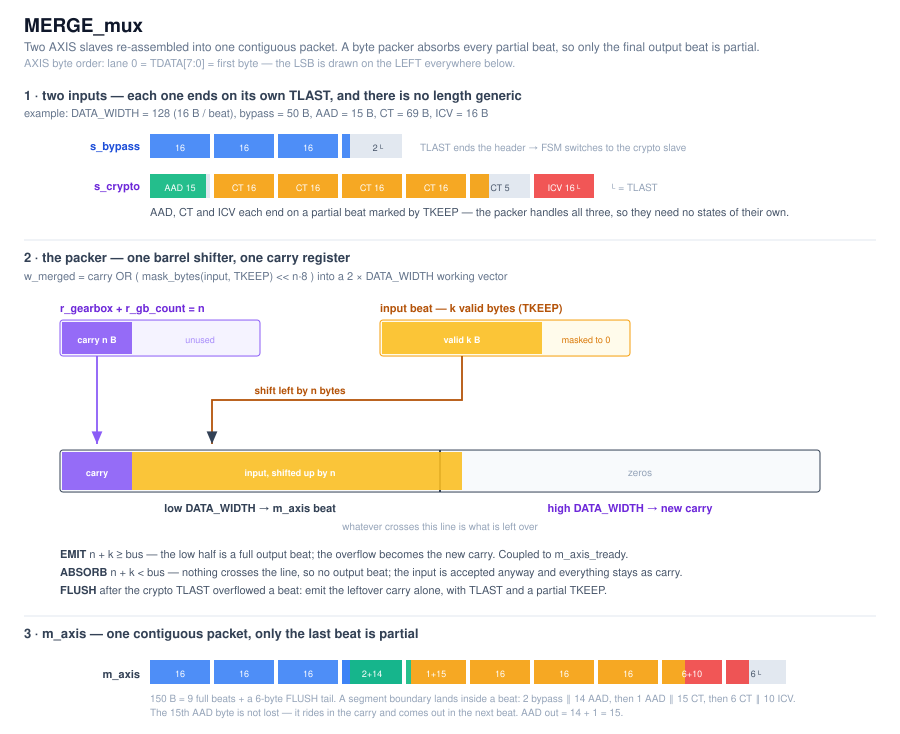
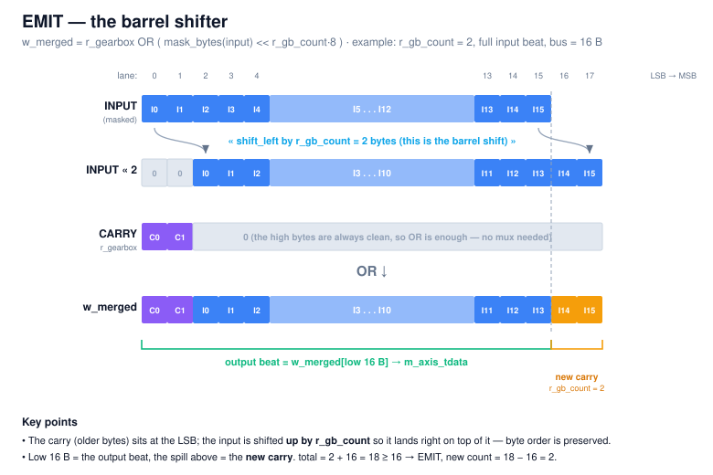
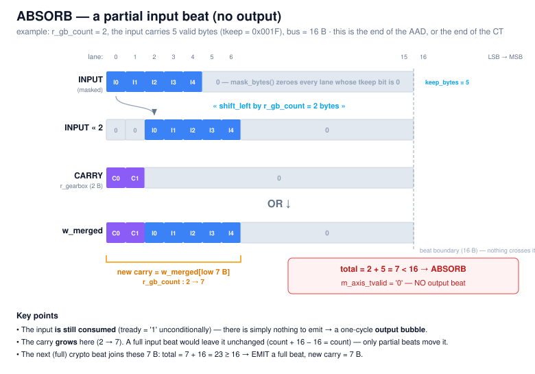

# MERGE_mux

The inverse of `SPLIT_demux`. It re-assembles one contiguous AXI-Stream packet
from two slaves:

- **`s_bypass`** — the bypass segment, passed through untouched, ending on its own `TLAST`.
- **`s_crypto`** — the AES-GCM core output `AAD || CT || ICV`, ending on `TLAST` after the tag.

The output `m_axis` is byte-contiguous: **only the final beat is partial**.



---

## Interface

| Generic | Meaning |
|---|---|
| `DATA_WIDTH` | Bus width in bits; `c_BUS_BYTES = DATA_WIDTH/8`. Verified for 64 / 128 / 256. |

There is **no length generic** — and there does not need to be. Unlike `SPLIT_demux`,
which has to *cut* a single stream at a boundary nothing in the data marks,
`MERGE_mux` receives two streams that each announce their own end with `TLAST`.

Ports are standard AXIS (`tdata/tkeep/tvalid/tlast/tready`), one clock `i_clk`,
active-low reset `i_rstn`.

**Byte order:** lane 0 = `TDATA[7:0]` = first byte of the stream. The gearbox
stores its carried bytes right-aligned at the LSB.

**Contract:** the bypass stream *must* raise `TLAST` on its last beat, otherwise
the core never leaves `S_BYPASS`. In the full chain that `TLAST` is exactly the
one `SPLIT_demux` produced on `m_bypass`; the crypto `TLAST` comes from the GCM
glue at the end of the ICV.

---

## The packer

`AAD`, `CT` and `ICV` each end on a partial beat marked by `TKEEP`, and the
bypass segment usually does too. A byte packer normalises **any** sequence of
`TKEEP`-tagged beats into full output beats, which is why those three segments
need no states of their own — a single `S_MERGE` handles all of them.

State is one carry register plus its byte count:

| Signal | Meaning |
|---|---|
| `r_gearbox` | The carried bytes, right-aligned at the LSB. |
| `r_gb_count` = `n` | How many of them are valid (`0 .. bus−1`). |

Every cycle the datapath computes one working vector, twice the bus width:

```vhdl
w_merged <= resize(unsigned(r_gearbox), c_WORK_WIDTH)
            or shift_left(resize(unsigned(mask_bytes(w_in_data, w_in_keep)), c_WORK_WIDTH),
                          to_integer(r_gb_count) * 8);
w_total  <= to_integer(r_gb_count) + keep_bytes(w_in_keep);   -- n + k
```

The carry sits in the low bytes; the input, masked by its `TKEEP` and shifted up
by `n` bytes, lands right on top of it. Splitting `w_merged` at `DATA_WIDTH` then
gives both answers at once:

- **low half** → the output beat
- **high half** → the new carry (whatever crossed the line)

| Case | Condition | Output beat | New carry |
|---|---|---|---|
| **EMIT** | `n + k ≥ bus` | low half of `w_merged`, full beat | high half, `n′ = n + k − bus` |
| **ABSORB** | `n + k < bus` | none | low half, `n′ = n + k` |

`w_emit` also goes high on the crypto `TLAST` even when `n + k < bus`, because
that beat is the forced last one.

### The barrel shifter

`shift_left(..., n·8)` is the **only** barrel shifter in the design, and the only
part of the datapath whose wiring changes at run time — everything else is fixed
slices. It is also the expected critical path.

Two things make the OR work, and both are worth stating because they are what
keeps a second mux out of the datapath:

1. `mask_bytes(input, TKEEP)` zeroes every invalid lane, so the shifted input can
   never collide with the carry.
2. The carry's high bytes are always clean (they were zeroed when it was last
   written), so the shifted input lands on zeros.

`n = 2` with a **full** input beat — the input spills two bytes past the bus
boundary, and those two bytes are the new carry:



The same shifter, same `n = 2`, but a **partial** input beat (5 valid bytes — the
end of the AAD, or the end of the CT). Now nothing reaches the boundary, so there
is no output beat at all: the input is still accepted (`tready = '1'`
unconditionally) and everything simply becomes the new, larger carry. This is the
ABSORB case, and the one-cycle output bubble it creates:



Note what the carry count does. On a **full** input beat it does not move
(`n + bus − bus = n`); it only changes on a **partial** beat. That is exactly why
partial beats are the interesting ones, and why AAD, CT and ICV each ending on a
partial beat is the whole reason this core exists.

---

## States

| State | Slave read | Output | Leaves when |
|---|---|---|---|
| `S_BYPASS` | `s_bypass` | Packed bypass beats (EMIT/ABSORB). Never `TLAST`. | `s_bypass_axis_tlast` is accepted → `S_MERGE`. |
| `S_MERGE` | `s_crypto` | Packed `AAD ‖ CT ‖ ICV` beats. On the crypto `TLAST`: if `n + k ≤ bus` this beat *is* the last — `TKEEP = keep_mask(n+k)`, `TLAST = 1`. | crypto `TLAST` accepted → `S_FLUSH` if `n + k > bus`, else back to `S_BYPASS`. |
| `S_FLUSH` | none | The leftover carry alone: `TDATA = r_gearbox`, `TKEEP = keep_mask(n)`, `TLAST = 1`. | the beat is accepted → `S_BYPASS`. |

Back-pressure follows directly from EMIT/ABSORB: an **EMIT** beat is coupled to
`m_axis_tready` (input and output handshake in the same cycle), while an
**ABSORB** beat accepts the input **unconditionally** — it produces no output, so
there is nothing to wait for. `S_FLUSH` consumes no input at all.

---

## Worked example — `DATA_WIDTH = 128`, bypass 50 B, AAD 15 B, CT 69 B, ICV 16 B

Input: bypass = 4 beats (16, 16, 16, **2** + `TLAST`); crypto = 7 beats
(AAD **15**, four full CT beats, CT tail **5**, ICV 16 + `TLAST`).

| State | Input beat | `n` before | `n + k` | Action | Output beat | `n` after |
|---|---|---|---|---|---|---|
| `S_BYPASS` | 16 B | 0 | 16 | EMIT | 16 B bypass | 0 |
| `S_BYPASS` | 16 B | 0 | 16 | EMIT | 16 B bypass | 0 |
| `S_BYPASS` | 16 B | 0 | 16 | EMIT | 16 B bypass | 0 |
| `S_BYPASS` | 2 B, `TLAST` | 0 | 2 | **ABSORB** | — | 2 |
| `S_MERGE` | AAD 15 B | 2 | 17 | EMIT | 2 bypass ‖ 14 AAD | 1 |
| `S_MERGE` | CT 16 B | 1 | 17 | EMIT | **1 AAD ‖ 15 CT** | 1 |
| `S_MERGE` | CT 16 B ×3 | 1 | 17 | EMIT ×3 | 16 B CT each | 1 |
| `S_MERGE` | CT 5 B | 1 | 6 | **ABSORB** | — | 6 |
| `S_MERGE` | ICV 16 B, `TLAST` | 6 | 22 | EMIT (overflow) | 6 CT ‖ 10 ICV | 6 |
| `S_FLUSH` | — | 6 | — | flush | 6 B ICV tail, `TLAST` | 0 |

150 bytes out = 9 full beats + a 6-byte tail. The two ABSORB cycles are where a
partial input beat is swallowed without producing anything.

Note the 15th AAD byte: the first EMIT of `S_MERGE` only gets 14 of them out,
because the beat was already carrying 2 bypass bytes. The last one rides in the
carry (`n = 1`) and leaves in the **next** beat, ahead of the ciphertext — so AAD
out is `14 + 1 = 15`. The same thing happens at every segment boundary; the
packer never aligns a segment, it just never loses a byte.

---

## Testbench

`tb/tb_MERGE_mux.vhd` (self-checking) + `tb/run_merge_mux_tests.sh` (GHDL,
`--std=08 -fsynopsys`).

The TB drives both slaves with a deterministic byte pattern (splitting the crypto
side into `AAD`, `CT` and `ICV` beats with the right `TKEEP`) and acts as the
`m_axis` slave; `TVALID` on both inputs and `TREADY` on the output are randomly
gated at `P_VALID` / `P_READY` percent. It rebuilds the output byte stream from
`TKEEP` and compares it against `bypass ‖ AAD ‖ CT ‖ ICV`, checking that every
beat except the last is full, that there is exactly one `TLAST`, and that the run
does not deadlock.

```bash
cd tb && ./run_merge_mux_tests.sh
```

---

## Notes

- The barrel shifter (`shift_left` by `n·8`) is the expected critical path: it is
  a `bus`-way byte rotate on a `2 × DATA_WIDTH` vector.
- `AAD = 0` and `CT = 0` are legal and covered by the regression.
- The final beat can be exact (`n + k = bus`), in which case there is no `S_FLUSH`
  at all and the crypto `TLAST` beat carries `TLAST` itself.
