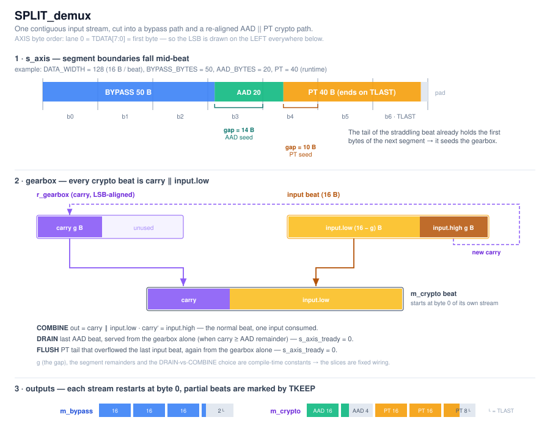

# SPLIT_demux

Splits one byte-contiguous AXI-Stream into two masters:

- **`m_bypass`** — the first `BYPASS_BYTES` (the bypass segment), passed through untouched.
- **`m_crypto`** — the rest as `AAD || PT`, re-aligned so that **AAD and PT each start at byte 0 of a beat**, which is what the AES-GCM glue expects.

`BYPASS_BYTES` and `AAD_BYTES` are generally not multiples of the bus width, so
the segment boundaries land *mid-beat* on the input. A carry register (the
**gearbox**) holds the bytes of the next segment that already arrived in the
straddling beat, and re-aligns them.



---

## Interface

| Generic | Meaning |
|---|---|
| `DATA_WIDTH` | Bus width in bits; `c_BUS_BYTES = DATA_WIDTH/8`. Verified for 64 / 128 / 256. |
| `BYPASS_BYTES` | Length of the bypass segment. |
| `AAD_BYTES` | Length of the AAD segment. |

The PT length is **not** a generic — it is discovered at run time from the input `TLAST`.

Ports are standard AXIS (`tdata/tkeep/tvalid/tlast/tready`), one clock `i_clk`,
active-low reset `i_rstn`.

**Byte order:** lane 0 = `TDATA[7:0]` = first byte of the stream. The gearbox
therefore stores its carried bytes **right-aligned at the LSB**, so the next
output beat is a plain concatenation.

---

## Compile-time constants

| Constant | Formula | Meaning |
|---|---|---|
| `c_GAP_AFTER_BYPASS` | `(bus − BYPASS mod bus) mod bus` | AAD bytes carried out of the last bypass beat = carry held during `S_AAD`. |
| `c_GAP_AFTER_AAD` | `(bus − (BYPASS+AAD) mod bus) mod bus` | PT bytes carried out = carry held during `S_DATA`. |
| `c_BYP_REM` | `((BYPASS−1) mod bus) + 1` | Valid bytes in the last bypass beat. |
| `c_AAD_REM` | `((AAD−1) mod bus) + 1` | Valid bytes in the last AAD beat. |
| `c_AAD_LAST_IS_DRAIN` | `c_GAP_AFTER_BYPASS ≥ c_AAD_REM` | Whether the last AAD beat is served from the gearbox alone. |

Because they are constants, every byte slice synthesises to **fixed wiring** — there is no barrel shifter.

---

## States — what happens to the data

| State | Master | Data on the output | Gearbox after the beat |
|---|---|---|---|
| `S_BYPASS` | `m_bypass` | `s_axis_tdata` straight through. On the last beat `TKEEP = keep_mask(c_BYP_REM)` and `TLAST = 1`. | On the last beat only: capture the top `c_GAP_AFTER_BYPASS` input bytes (**AAD seed**). |
| `S_AAD` | `m_crypto` | **COMBINE**: `carry ‖ input.low`, full beat. Last AAD beat: `TKEEP = keep_mask(c_AAD_REM)`. | COMBINE: carry = top `c_GAP_AFTER_BYPASS` input bytes. Last AAD beat: leaves exactly `c_GAP_AFTER_AAD` bytes (**PT seed**) — see below. |
| `S_DATA` | `m_crypto` | **COMBINE**: `carry ‖ input.low`. On input `TLAST` see the PT ending below. | Carry = top `c_GAP_AFTER_AAD` input bytes. |
| `S_FLUSH` | `m_crypto` | The leftover PT tail, straight from the gearbox, with `TLAST = 1`. | — |

`r_cnt` counts **emitted output beats** per segment, not input handshakes — a
re-aligned segment can emit more beats than it consumes.

Transitions are driven by the **output** handshake (`tvalid and tready`), because
the DRAIN and FLUSH beats consume no input at all. On those beats
`s_axis_tready` is forced to `0`.

---

## The three segment endings

**1 · Bypass → AAD** (fixed). Last bypass beat carries `c_BYP_REM` header bytes
plus the first `c_GAP_AFTER_BYPASS` AAD bytes. The header part goes out on
`m_bypass`; the AAD part seeds the gearbox.

**2 · AAD → PT** (fixed). The last AAD beat must leave exactly `c_GAP_AFTER_AAD`
bytes behind as the PT seed. Which way it does that is decided at compile time:

| Condition | Last AAD beat | Consumes input? | Carry left behind |
|---|---|---|---|
| `gap_byp ≥ aad_rem` | **DRAIN** — emit from the gearbox, shift it down by `aad_rem` | no (`tready = 0`) | `gap_byp − aad_rem` |
| `gap_byp < aad_rem` | **COMBINE** — take one more input beat | yes | `bus − (aad_rem − gap_byp)` |

Both land on `c_GAP_AFTER_AAD`.

**3 · PT end** (runtime). On the input `TLAST` beat with `k` valid bytes, let
`total = c_GAP_AFTER_AAD + k`:

- `total ≤ bus` — this is already the last beat: emit it with `TLAST` and `TKEEP = keep_mask(total)`.
- `total > bus` — emit a full beat now (`TLAST = 0`), stash the overflow, and go to `S_FLUSH`, which emits the tail with `TLAST`.

There is one more case: if the whole PT arrived inside the beat that carried the
AAD tail (`0 < PT ≤ c_GAP_AFTER_AAD`), the input is already exhausted when the
AAD ends. `w_in_done` detects that and `S_AAD` jumps straight to `S_FLUSH` —
otherwise `S_DATA` would wait forever for a beat that never comes.

---

## Worked example — `DATA_WIDTH=128, BYPASS=50, AAD=20`, PT = 40 bytes

Constants: `gap_byp = 14`, `aad_rem = 4`, `gap_aad = 10`, `c_AAD_LAST_IS_DRAIN = (14 ≥ 4) = true`.

Input is 110 bytes = 7 beats (`b0..b6`, `b6` has 14 valid bytes + `TLAST`).

| State | Input | `m_bypass` | `m_crypto` | Gearbox after |
|---|---|---|---|---|
| `S_BYPASS` | b0, b1, b2 | 16, 16, 16 B | — | — |
| `S_BYPASS` | b3 | 2 B, `TLAST` | — | 14 B = AAD[0..13] |
| `S_AAD` cnt=0 | b4 | — | 16 B = AAD[0..15] | 14 B = AAD[16..19] ‖ PT[0..9] |
| `S_AAD` cnt=1 | — (**DRAIN**) | — | 4 B = AAD[16..19] | 10 B = PT[0..9] |
| `S_DATA` | b5 | — | 16 B = PT[0..15] | 10 B = PT[16..25] |
| `S_DATA` | b6 (`TLAST`) | — | 16 B = PT[16..31] | 8 B = PT[32..39] |
| `S_FLUSH` | — | — | 8 B = PT[32..39], `TLAST` | — |

`b6` gives `total = 10 + 14 = 24 > 16`, so it overflows and `S_FLUSH` runs.
`m_bypass` = 50 B, `m_crypto` = 20 B AAD + 40 B PT.

---

## Testbench

`tb/tb_SPLIT_demux.vhd` (self-checking) + `tb/run_split_demux_tests.sh` (GHDL,
`--std=08 -fsynopsys`).

The TB drives a deterministic byte pattern as the AXIS master and is the slave on
both outputs; `TVALID` and both `TREADY`s are randomly gated at `P_VALID` /
`P_READY` percent. It rebuilds each output byte stream from `TKEEP` and compares
it against the reference: `m_bypass == bytes[0 .. BYPASS-1]` and
`m_crypto == bytes[BYPASS .. BYPASS+AAD+PT-1]`, with exactly one `TLAST` per
stream and a deadlock timeout.

```bash
cd tb && ./run_split_demux_tests.sh
```

One config with a per-beat listing:

```bash
ghdl -r --std=08 -fsynopsys --workdir=tb/ghdl_work tb_SPLIT_demux \
  -gDATA_WIDTH=128 -gBYPASS_BYTES=50 -gAAD_BYTES=20 -gPT_BYTES=40 \
  -gP_VALID=100 -gP_READY=100 -gDEBUG=1
```

---

## Notes

- The aligned corner (`gap = 0`) relies on null-range slices behaving as no-ops.
  It is covered by the `96/32`, `64/16` and `256 96/64` configs.
- `AAD_BYTES` here only sizes the *split*. The GHASH length block in the GCM glue
  has its own `AAD_BYTES` generic and must be given the same value.
